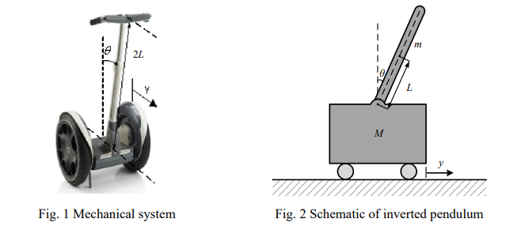
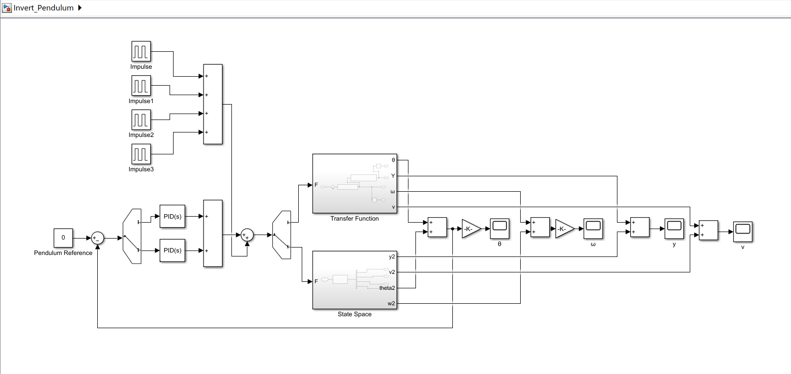
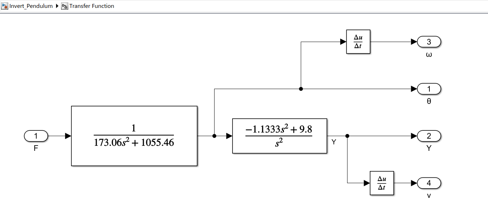
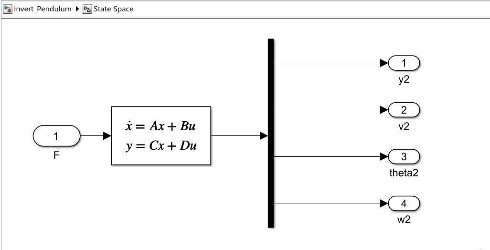
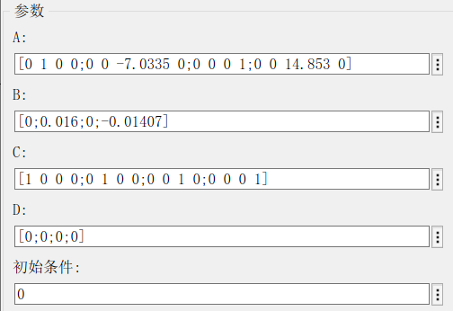
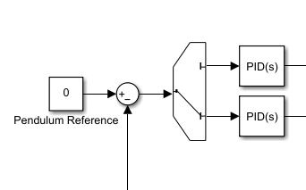
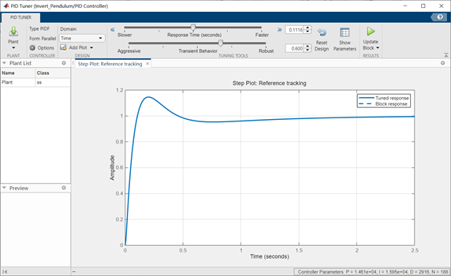

# **Invert Pendulum**
机械系统动力学实验项目
>Software: MATLAB 2021b

## Introduction
The Segway is a two-wheeled self-balancing electric vehicle, as shown in Fig. 1. In this problem, we only consider the translational motion of the vehicle and rotation of the control panel bar. The mechanical system (Fig. 1) can be modeled as an inverted pendulum shown in Fig. 2.
For a driver with mass m, height 2L (effective moment of inertia I = mL^2/3), assume the mass of the control panel bar can be neglected compared to the driver and the inclination angle is small.

## [System Modeling](Invert_Pendulum.slx)

<!-- ### Transfer Function

### State Space

 -->
## Controller Design
由于通过Transfer Function和State Space得到的系统特性有一点区别，所以PID参数会不一样(我也不知道为什么)。总之为了方便起见，我还是设置了两个PID控制器分别对两者进行控制。

<!-- 参数调整大致如下： 
 -->

## [Results](Inv_Pen.m)
实现平衡效果如下：

在改变`Pendulum Reference`参数以后，可以实现平衡小车以预定倾角前进或者后退，本例中设置倾角为20°  
<!--    -->
